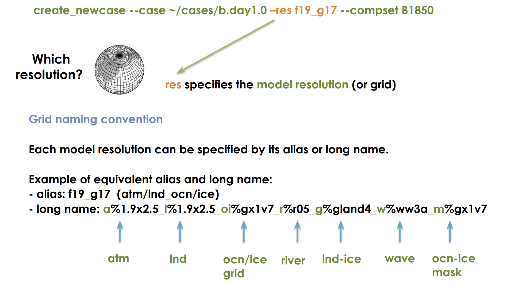

You have now downloaded all the model components. Let's take a look:
From your `/home/username/classes/clim670/ccpp-scm-6.0` directory, see what is there.
~~~
$ ls
~~~
{: .language-bash}

#### Organization of the CCPP-SCM Directory

* scm - Top level SCM directory: contains the dynamical core
* ccpp - Top level CCPP directory: contains physics packages
* CMakeModules - Contains modules required to run the code
* contrib - Contains scripts that download data files required to run the model
* docker - Top directory for building CCPP-SCM container (not used in this class)
* test - Top directory of a test case
* tutorial_files - Examples used by developers in tutorials 

### Using existing libraries
The Python environment must provide the f90nml module for the SCM scripts to function. Users can test if f90nml is installed using this command in the shell:
~~~
$ python -c "import f90nml"
~~~
{: .language-bash}

If f90nml is installed, this command will succeed silently, otherwise an ImportError: No module named f90nml will be printed to screen. To install the f90nml (v0.19) Python module, use:

~~~
$ module load anaconda3
$ pip install --user f90nml ==0.19
~~~
{: .language-bash}

Platform-specific scripts are provided to load modules and set the user environment for preconfigured platforms. These scripts load compiler modules (Fortran 2008-compliant), the NetCDF module, Python environment, etc. and set compiler and environment variables. 
~~~
$ cd /home/username/classes/clim670/ccpp-scm-6.0/scm/etc/
$ ls 
~~~
{: .language-bash}

Hopper is not one of the preconfigured platforms. To get the corresponding file for Hopper: 
~~~
$ cp /home/cstan/classes/clim670/ccpp-scm/scm/etc/Hopper_setup* . 
~~~
{: .language-bash}

Let's take a look:
From your `/home/username/classes/clim670/ccpp-scm-6.0/scm/etc/` directory, see what is there.
~~~
$ ls
~~~
{: .language-bash}

Now you have two new files that will configure the building environmeent for Hopper. One can be used for the t/csh shell and the other for the bash shell. To source the file:

~~~
$ cd ../../
$ . scm/etc/Hopper_setup_gnu.sh
~~~
{: .language-bash}

Ignore the warnings. 

The first step in compiling the CCPP and SCM is to properly setup your user environment as described in sections above. The second step is to download the lookup tables and other large datasets (large binaries, <1 GB) needed by the physics schemes and place them in the correct directory. I have downloaded these files and you will create symbolic links:

~~~
$ cd /home/username/classes/clim670/ccpp-scm-6.0/scm/data/
$ 
~~~
{: .language-bash}

Above were the one-time setup setps, now we move on to the steps you will do everytime to setup a new model experiment and run it.

Go into the scripts subdirectory in your `CIMEROOT`
~~~
$ cd /glade/work/kpegion/cesm2.1.1/cime/scripts
~~~
{: .language-bash}

Create a new case
~~~
$ ./create_newcase --case ~/cases/b.day1.0 --res f19_g17 --compset B1850 --project UGMU0032
~~~
{: .language-bash}

This created a new subdirectory for your new case. Change to that directory.
~~~
$ cd ~/cases/b.day1.0 
~~~
{: .language-bash}

Setup the case
~~~
$ ./case.setup
~~~
{: .language-bash}

Build the executable (this will take while)
~~~
$ qcmd -- ./case.build
~~~
{: .language-bash}

This will take awhile.  While the model is compiling, we will talk about what the `create_newcase` command did.

> ## Potential Errors
>
> Some users received an error indicating that their account was overspent or expired. This happened to users who already had a NCAR account associated with a project charge code that was no longer available.  To resolve this, set the `PBS_ACCOUNT` environment variable to a valid charge code for this class.
> ~~~
> $ export PBS_ACCOUNT=UGMU0032
> ~~~
> {: .language-bash}
> This setting will go away after you logout, so you will need to set it everytime for the correct project charge code associated with the project you are working on. 
>
{: .callout}

#### What did we just do?

`create_newcase` takes 3 arguments

#### Case Name (`case`)
This is the name and location of your experiment
* Can be anything you want
* It is a good idea to make it descriptive so you can distinguish different cases
* NCAR has reccomended naming conventions

This experiment is called `b.day1.0` and it is located in my cases directory in my home directory.

#### Resoultion (`res`)
Specifies the resolution and grid of the model components.
Each model resolution can be specified by its alias or long name.

How to know what grids are available?
There's a tool

~~~
$ CIMEROOT/scripts/query_config --grids --long 
~~~
{: .language-bash}

and a [website](http://www.cesm.ucar.edu/models/cesm2/config/grids.html)

> ## Understanding grids
>
> The resolution f09_g17 is the standard resolution used for CMIP simulations 
> with the CESM. What is the resolution of the atmosphere/land and ocean in this model?
>
>
{: .challenge}

#### Component Set (`compset`)

Sets which versions and component models are active vs. inactive and what forcings are used.  
The first letter `B` in this compset indicate that all components are active.  The `1850` means that the 1850 greenhouse gas forcings will be used.

How do I know what the different compsets are?

There's a tool

~~~
$ CIMEROOT/scripts/query_config --compsets
~~~
{: .language-bash}

and a [website](http://www.cesm.ucar.edu/models/cesm2/config/compsets.html)

Some Common Compset Starting Characters
* `B` all components are active
* `F` atmosphere is active; ocean and ice are inactive
* `I` land is active
* `G` ocean is active
* `A` aquaplaned (atm with no land)

Certain compsets are `scientifically validated` meaning they have been extensively tested.  
You can create your own compsets.
It is strongly suggested that you start developing any experiments from a scientifically validated compset, then make changes.
The selected compset determines which grids are available.

### The `CASEROOT` directory

This was created when you ran `create_newcase`. Change directory and take a look at it:

~~~
$ cd ~/b.day1.0
$ ls
~~~
It contains a bunch of `.xml` files which are configuration files.  We will learn how to modify them next week.

#### What happened when we ran `case.setup`?
* Your RUNDIR and EXEROOT directories were created
* A bunch of user.nl.xxx files were created (these are namelist files that provide configuraiton details to different component models)
* Created the `case.run` and `case.st_archive` scripts 
* Create a CaseDocs directory

### What happened when we ran `case.build`?
* Checked that all the input data was available
* Created the namelists from the user specified ones above
* Compiled the model

### How can I find out what my CASEROOT, CIMEROOT, etc. are if I forget?
~~~
$ ./xmlquery RUNDIR,EXEROOT,CASEROOT,CIMEROOT
~~~
{: .language-bash}

### Now what?

If your build has completed, then you can submit your model run to the queue.
~~~
$ ./case.submit
~~~
{: .language-bash}

You can see that is is in the queue, using
~~~
$ qstat -u username
~~~
{: .language-bash}

What do we see regarding the model run in the queue?

You can logout now.  While we are away, our model will run.  We will return next week to take a look!

